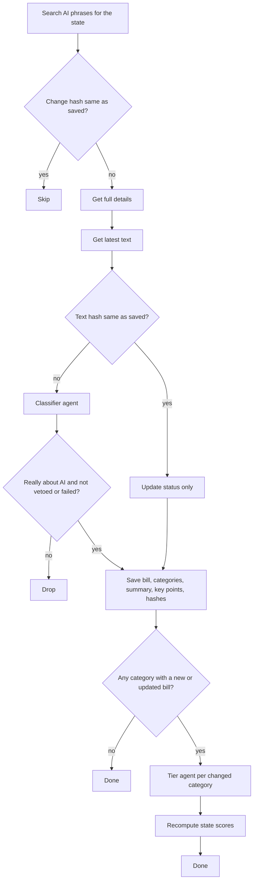

# Data pipeline

Convex cron jobs pull data from outside APIs, process it, and save it to Convex so the app can show it. Everything runs in TypeScript inside Convex. The API calls and classifier calls happen in Convex actions. No outside scheduler is needed.

Sources:

- LegiScan for bills
- Compute Atlas for data center facilities

The first run pulls everything to fill the database. Later runs only process what changed since the last run.

```mermaid
flowchart LR
  L[LegiScan bills job] --> B[(bills)]
  B --> T[(tiers)]
  C[Compute Atlas job] --> F[(facilities)]
  T --> S[state scores]
  F --> S
```

## LegiScan bills

For each state:

1. Search for all bills that have anything to do with AI. The phrases below go into one search joined with OR, so a state costs one call instead of seven. Each phrase is quoted so LegiScan matches the exact phrase. Unquoted, "data center" turns into data AND center and matched 1,533 California bills instead of 61.
   - "artificial intelligence"
   - "automated decision"
   - "algorithmic"
   - "deepfake"
   - "synthetic media"
   - "chatbot"
   - "data center"

   Later runs use LegiScan's raw search. It returns only bill IDs and change hashes, but all of them in a single call, and that is all the hash compare needs. The first fill uses the full search instead, which is paged 50 at a time but carries each bill's last action date, so bills older than the start date (2021) are dropped before spending anything on them.
2. Compare each result's change hash to the one saved in Convex. Skip bills whose hash has not changed. Keep new bills and bills whose hash is different. Bills dropped on an earlier run (not about AI, vetoed or failed, no text yet) are remembered with their hash too, so they are skipped for free until something about them changes. The remaining bills are worked through in small scheduled batches, since one Convex action cannot run longer than ten minutes.
3. For each remaining bill, get the full details. Batch these requests.
4. Get the latest text of each bill. Titles are often vague, so the classifier needs the full text. LegiScan returns it as HTML or PDF depending on the state. HTML is stripped to plain text. PDF is converted to plain text once with a PDF library. The full text is stored in Convex file storage, with no size cap, so the classifier can be re-run later without another LegiScan call. Each text also has a hash. If the text hash matches the saved one, skip the classifier and only update the bill's status. If it differs, the stored text is replaced.
5. Run a classifier agent on each bill. First it decides if the bill is really about AI. Search results are fuzzy, and some bills only mention AI in passing. Those are dropped. Bills that were vetoed or failed are dropped too. For the rest, it picks which regulation categories the bill covers and writes a summary and key points.
6. Save the bills to Convex, including the change hash and text hash.
7. Only re-tier categories that had a new or updated bill in this run. Skip the rest. For each of those categories, load all of that state's bills in the category and run a second agent. It assigns a tier for the state in that category.
8. Save the tiers to Convex.
9. Recompute the state scores for any state whose tiers changed. The AI regulation score (0 to 6) comes from the state's tiers across all categories. The data center posture score (-3 to +3) comes from the data center tier plus the state's facilities. Both use a plain formula, not an agent. The formulas are not decided yet.
10. Save the scores to Convex.

Re-running the agents without LegiScan: `reclassify` re-runs the classifier on every saved bill from its stored text, then re-tiers and rescores what changed. `retier` re-runs the tier agent on every graded category and rescores. Use them after changing a prompt, the categories, or the model. Both cost OpenAI calls only.

How the hashes work: LegiScan gives every bill a change hash that updates when anything about the bill changes, and every bill text a text hash. Saving both lets a run tell what is new without a date filter. Search calls are cheap. Details, text, and classifier calls are not, so the hashes are what keep later runs small.

## Compute Atlas facilities

Compute Atlas is one public API call that returns every US data center. There is no per-state loop and no hashes. Each run replaces the whole facilities table.

1. Fetch the full facility list. About 1,600 records come back in one call. Also fetch the stats endpoint to record which edition of the dataset this is.
2. Keep only records where the facility type is data center. Drop cancelled facilities.
3. Map each record to a Facility: name, operator, state, status, and capacity in MW. Compute Atlas has five statuses and our model has three, so permitted becomes proposed. Operational, under construction, and proposed stay as they are.
4. Replace the facilities table in Convex with the new list. Match on the Compute Atlas ID so a facility keeps its record across runs.
5. Recompute the data center posture score for every state whose facilities changed. This is the same formula as step 9 of the bills job. It uses the state's data center tier plus its facilities. The formula is not decided yet.
6. Save the scores to Convex.
