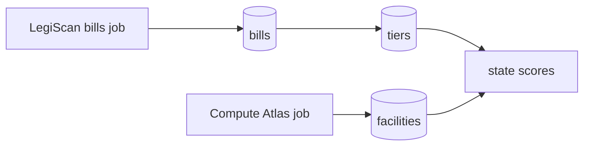
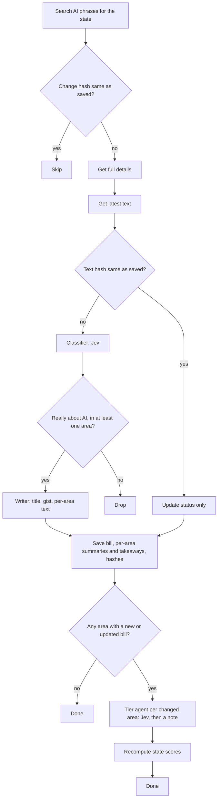

# Data pipeline

Convex cron jobs pull data from outside APIs, process it, and save it to Convex so the app can show it. Everything runs in TypeScript inside Convex. The API calls and classifier calls happen in Convex actions. No outside scheduler is needed.

Sources:

- LegiScan for bills
- Compute Atlas for data center facilities

The first run pulls everything to fill the database. Later runs only process what changed since the last run.



## LegiScan bills

For each state:

1. Search for all bills that have anything to do with AI. The phrases below go into one search joined with OR, so a state costs one call instead of seven. Each phrase is quoted so LegiScan matches the exact phrase. Unquoted, "data center" turns into data AND center and matched 1,533 California bills instead of 61.
   - "artificial intelligence"
   - "automated decision"
   - "algorithmic"
   - "deepfake"
   - "synthetic media"
   - "chatbot"
   - "data center"

   Later runs use LegiScan's raw search. It returns only bill IDs and change hashes, but all of them in a single call, and that is all the hash compare needs. The first fill uses the full search instead, which is paged 50 at a time but carries each bill's last action date, so bills older than the start date (2021) are dropped before spending anything on them.
2. Compare each result's change hash to the one saved in Convex. Skip bills whose hash has not changed. Keep new bills and bills whose hash is different. Bills dropped on an earlier run (not about AI, vetoed or failed, no text yet) are remembered with their hash too, so they are skipped for free until something about them changes. The remaining bills are worked through in small scheduled batches, since one Convex action cannot run longer than ten minutes.
3. For each remaining bill, get the full details. Batch these requests.
4. Get the latest text of each bill. Titles are often vague, so the classifier needs the full text. LegiScan returns it as HTML or PDF depending on the state. HTML is stripped to plain text. PDF is converted to plain text once with a PDF library. The full text is stored in Convex file storage, with no size cap, so the classifier can be re-run later without another LegiScan call. Each text also has a hash. If the text hash matches the saved one, skip the classifier and only update the bill's status. If it differs, the stored text is replaced.
5. Two agents read the text. First the classifier, which runs on Jev (TypeSafe's System One model). Jev does not write text; it answers typed questions with calibrated probabilities. It is asked one yes/no question per regulation area ("at least one provision of this bill regulates this subject", with the area's description and the upper lines of its rubric as examples of what counts) plus one for relevance (is AI a substantial purpose of the bill, not a passing mention). Long bills go in parts of about 40,000 characters, and each probability is the highest across the parts. A bill is kept when relevance is at least 0.5 and at least one area is; the numbers are saved with the bill. Bills that are vetoed or failed are dropped before this, and bills that are about AI but fit no area are remembered as skips under their own reason, so they are easy to find if an area is added later.

   Then the writer, a generative model (OpenAI, `CLASSIFIER_MODEL`), which only runs for bills that pass. The text is split into provisions, each with a stable id like `c22602-b-1` for § 22602(b)(1), and the writer sees those ids next to the text. Given the areas Jev picked, it writes a short title, a one or two sentence gist, and for each area a one-line summary plus one to five takeaways. A takeaway is a plain-English claim with the ids of the provisions that support it, so the Bill Reader can highlight them. The writer cannot add or drop areas.

6. Save the bill, one row per regulation area with its summary and takeaways, and the change hash and text hash to Convex.
7. Only re-tier areas that had a new or updated bill in this run. Skip the rest. For each of those areas, load the state's enacted bills in the area with their per-area summaries and takeaways, and ask Jev to score them against the area's five-line rubric (what tier 0 to 4 means for that area): once for the state's enacted law taken together, and once per bill on its own. The tier is the level Jev puts the most probability on; its confidence is saved with the grade, so a flat answer (a bill the rubric does not describe well) is easy to spot. The basis bills are the enacted bills that reach at least Light on their own. Pending bills do not raise a tier, so they are left out of the grading. The writer then puts the tier and its basis into a one-sentence note.

8. Save the tiers, notes, and basis bills to Convex.
9. Recompute the state scores for any state whose tiers changed. The AI regulation score (0 to 6) comes from the state's tiers across all areas. The data center posture score (-3 to +3) comes from the data center tier plus the state's facilities. Both use a plain formula, not an agent. The formulas are not decided yet.
10. Save the scores to Convex.



Re-running the agents without LegiScan, from the stored texts:

- `reclassify` re-runs the classifier (Jev) on every saved bill, or one state's, or a list of ids. Bills that no longer pass are dropped. Bills whose areas changed are handed to the writer again, since summaries and takeaways are per area; bills whose areas stayed the same keep their text and only get fresh probabilities. Touched areas are re-tiered. Use it after changing an area's description or rubric, or the thresholds. Cost: one Jev call per text part, OpenAI calls only where tags moved.
- `redescribe` re-runs the writer on saved bills without changing their tags, then re-tiers their areas. Use it after changing the writing prompt or the generative model. Cost: one OpenAI call per bill.
- `retier` re-runs the tier agent (Jev, plus one note per area from the writer) for every graded area and rescores. Use it after changing a rubric.

```
npx convex run legiscan/rerun:reclassify '{}'
npx convex run legiscan/rerun:redescribe '{"state":"CA"}'
npx convex run legiscan/rerun:retier '{}'
```

Before trusting a change to the questions, `node scripts/check-jev-tags.mts` and `node scripts/check-jev-tiers.mts` run the Jev side locally over every saved bill and print how the tags and tiers would move, writing nothing back (run them with `npx tsx` if Node refuses the extensionless imports).

Every outside call reserves budget first (`apiUsage`), under `LEGISCAN_MONTHLY_CAP`, `TYPESAFE_MONTHLY_CAP`, and `OPENAI_MONTHLY_CAP`. Jev is about a thousand times cheaper than the generative model and answers in under a second, so the classifier and tier agent can be re-run freely; the writer is the cost to watch.

How the hashes work: LegiScan gives every bill a change hash that updates when anything about the bill changes, and every bill text a text hash. Saving both lets a run tell what is new without a date filter. Search calls are cheap. Details, text, and classifier calls are not, so the hashes are what keep later runs small.

## Compute Atlas facilities

Compute Atlas is one public API call that returns every US data center. There is no per-state loop and no hashes. Each run replaces the whole facilities table.

1. Fetch the full facility list. About 1,600 records come back in one call. Also fetch the stats endpoint to record which edition of the dataset this is.
2. Keep only records where the facility type is data center. Drop cancelled facilities.
3. Map each record to a Facility: name, operator, state, status, and capacity in MW. Compute Atlas has five statuses and our model has three, so permitted becomes proposed. Operational, under construction, and proposed stay as they are.
4. Replace the facilities table in Convex with the new list. Match on the Compute Atlas ID so a facility keeps its record across runs.
5. Recompute the data center posture score for every state whose facilities changed. This is the same formula as step 9 of the bills job. It uses the state's data center tier plus its facilities. The formula is not decided yet.
6. Save the scores to Convex.
